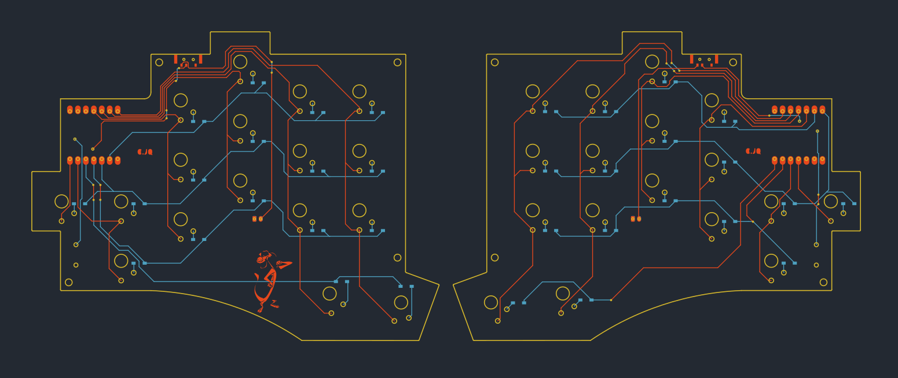

# DOOOPE Keyboard

---
DOOOPE Keyboard is a 34-key wireless split keyboard.

# LAYOUT
insert image
---
# PCB
[Here](JQ-C/DOOOPE/PCB) you can find the Kicad Files that includes the schematics
---
# Case
Coming soon  
The case file for the DOOOPE keyboard can be found [here]()
---
# Build Guide
Coming soon  
The build guide for the DOOOPE keyboard can be found [here]()
---
# Firmware
[ZMK Config](https://github.com/JQ-C/zmk-config) for the DOOOPE using Xiao BLe
---

# Project Reason
- DOOOPE keyboard was created to use Redragon low profile switch as a cheap alternative to the Low profile choc switches used in many Low-pro boards, hence the name "DOOOPE" that sounds like dupe.
- Another decision is to use off the shelf components and the cheapest at the category.
- This keyboard also used [Ergogen V4]() to prototype the layout and later finished in Kicad.

# Future Revision / To-Do
- Make it a reversible PCB to reduce cost
- Add support for both MX and Redragon Switch
 
# Credits
1. Overall inspiration is the execellent keyboard [Totem by GEIST](https://github.com/GEIGEIGEIST/TOTEM)
2. The exposed copper art is inspired by [Urchin by Kyek](https://github.com/duckyb/urchin)
3. The special "negative silkscreen" and overall silkscreen style by [Dilemma by bastardkb](https://github.com/Bastardkb/Dilemma)
4. I also want to thank the very helpful people in the [FingerPunch Discord]() that help guide me with the PCB creation.
---