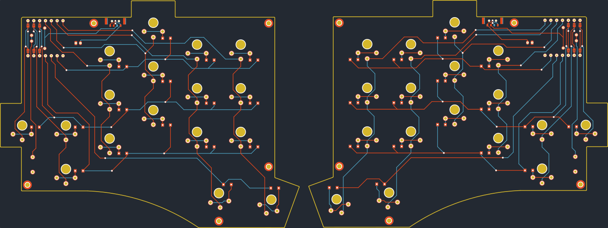

# DOOOPE. Real or Fake?

DOOOPE Keyboard is a 34-key wireless split keyboard. That uses Redragon low profile switches.

## Design Philosophy
DOOOPE was created with these in mind
- Budget at each category (MCU, Switch, Keycaps)
- Modular & Reusable parts
- Low Cost
- Low Profile
- Wireless
- 34 keys

# Resources

[Here](Kicad) you can find the Kicad files. 
 
[ZMK Config](https://github.com/JQ-C/zmk-config) for the DOOOPE using Xiao BLe

# Bill of Material
The link provided will be actual store i bought from but not affiliated with.
|Component|Amount|Remarks|Link|
|:----|:----|:----|:----|
|DOOOPE PCB|2|-| |
|SEEED Xiao BLE|2|-|[Cytron](https://my.cytron.io/p-seeed-xiao-ble-nrf52840-bluetooth-5p0)|
|Rechargeable Battery|2|28 x 18mm max| |
|Reset Switch|2|Through hole| |
|Power Switch|2|MSK12C02| [Shopee](https://shopee.com.my/10PCS-Slide-Switch-Micro-power-Toggle-Switch-Single-and-Double-row-Direct-inserted-Horizontal-Sliding-Second-Gear-Third-Gear-i.313127058.3661530160)|
|Pogo Pins|4|5mm|[Aliexpress](https://www.aliexpress.com/item/1005004016701633.html)|
|Redragon Switches|34|5mm|[Shopee](https://shopee.com.my/Redragon-SMD-RGB-MX-Low-Profile-Switch-3-Pin-for-Keyboard-Red-Black-Blue-Brown-i.326526863.10495732994?)|
|2mm male socket pins|4|1x7| |
|2.54 machine header pins|4|1x7| |
|JST PH 2.0 Connetor|2 Pair |-|[Shopee](https://shopee.com.my/10Sets-Lot-PH2.0-PH-2mm-Connector-Straight-needle-Seat-Plug-Terminals-2P-3P-4P-5P-6P-7P-8P-9P-10P-Connector-Pitch-2.0-i.313127058.5356644366?xptdk=3eb6c85b-3d97-453c-a1a4-ad3d53b7b325)|

# Build Guide
Coming soon  
The build guide for the DOOOPE keyboard can be found [here]()

# Project Reason
- DOOOPE keyboard was created to use Redragon low profile switch as a cheap alternative to the Low profile choc switches used in many Low-pro boards, hence the name "DOOOPE" that sounds like dupe.
- Another decision is to use off the shelf components and the cheapest at each category.
- This keyboard also used [Ergogen V4]() to prototype the layout and later finished in Kicad.

# Credits & Learning Resources

## Credits
1. Overall inspiration is the execellent keyboard [Totem by GEIST](https://github.com/GEIGEIGEIST/TOTEM)
2. The exposed copper art is inspired by [Urchin by Kyek](https://github.com/duckyb/urchin)
3. The special "negative silkscreen" and overall silkscreen style by [Dilemma by bastardkb](https://github.com/Bastardkb/Dilemma)
4. Pogo pin footprint from [Tlalocohyla Smithii by LuarRaNa](https://github.com/LuarRaNa/tlalocohyla_smithii)
5. Switch and much more footprint from [FingerPunch by SadekBaroudi](https://github.com/sadekbaroudi/fingerpunch)

I also want to thank the very helpful people in the [FingerPunch Discord]() that help guide me with the PCB creation.

## Learning Resources
The execellent [Ergogen Guide](https://web.archive.org/web/20230508055048/https://flatfootfox.com/ergogen-introduction/) by @FlatFootFox from the [Ergogen Discord](http://discord.ergogen.xyz/). Fall into the rabbit hole now with [Ergogen WebUI](https://ergogen.cache.works/).  

Great Non-keyboard Kicad Guide to get comfortable with the tool [STM32 PCB Design by Phils Lab](https://www.youtube.com/watch?v=aVUqaB0IMh4).